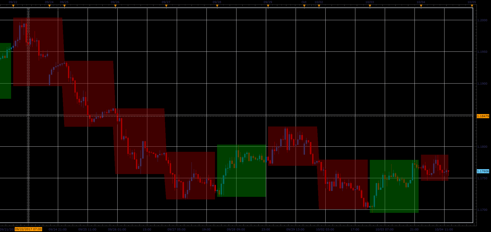

# Time trading range indicator

> Source: https://fxcodebase.com/code/viewtopic.php?f=48&t=65290  
> Forum: 48 · Topic 65290 · 1 post(s)

---

## Time trading range indicator

**Alexander.Gettinger** · Sat Oct 28, 2017 1:16 pm

The indicator show range box from [BeginTime] to [EndTime] and continues this to [BoxEndTime]. Color of box depends on price direction between [BeginTime] and [EndTime].
Indicator can be useful for people who trading in different trade sessions.

 

Download:

 [TTR_JS.jsl](files/115715/TTR_JS.jsl)
