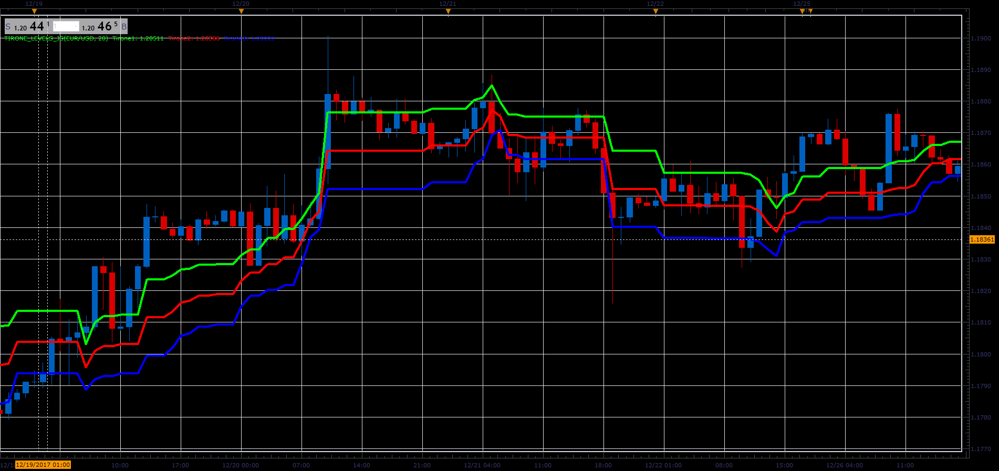

# Tirone's levels

> Source: https://fxcodebase.com/code/viewtopic.php?f=48&t=65594  
> Forum: 48 · Topic 65594 · 1 post(s)

---

## Tirone's levels

**Alexander.Gettinger** · Sat Jan 06, 2018 6:25 pm

This method of technical analysis developed by John Tirone in his book "Classical Technical Analysis as a Powerful Trading Methodology".

Formulas:
Tirone Level 1 = Hhigh - (Hhigh-Llow)/3
Tirone Level 2 = Llow + (Hhigh-Llow)/2
Tirone Level 3 = Llow + (Hhigh-Llow)/3, where
Hhigh and Llow is a maximum and minimum prices in the range from i-Period to i.

 

Download:

 [Tirone_Levels_JS.jsl](files/116873/Tirone_Levels_JS.jsl)
