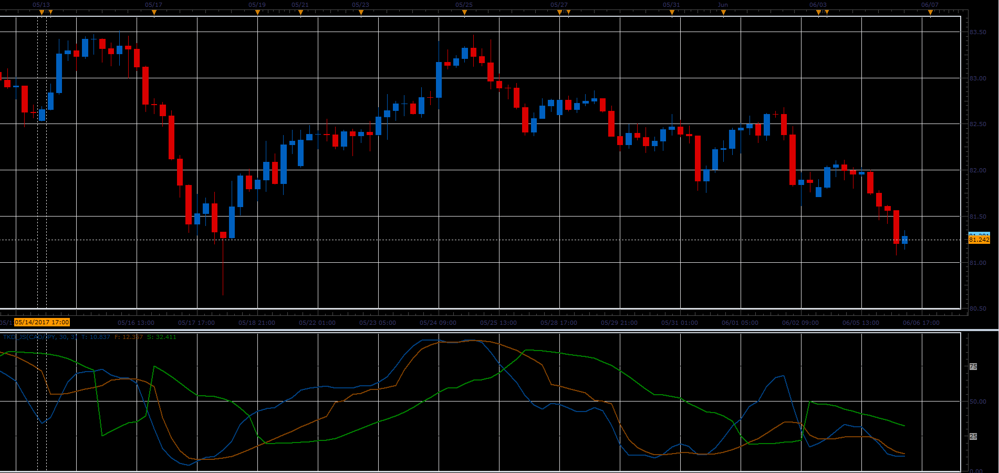

# TKD Indicator

> Source: https://fxcodebase.com/code/viewtopic.php?f=48&t=64858  
> Forum: 48 · Topic 64858 · 1 post(s)

---

## TKD Indicator

**Alexander.Gettinger** · Wed Jun 28, 2017 12:10 pm

This Indicator is the moderate predictor which is Adapted Stochastic KD with Trailing Signal. It represents that predict of coincident timing.
The TKD is one of the predictors developed by Richard Tao.

 

Download:

 [TKD_JS.jsl](files/113250/TKD_JS.jsl)
