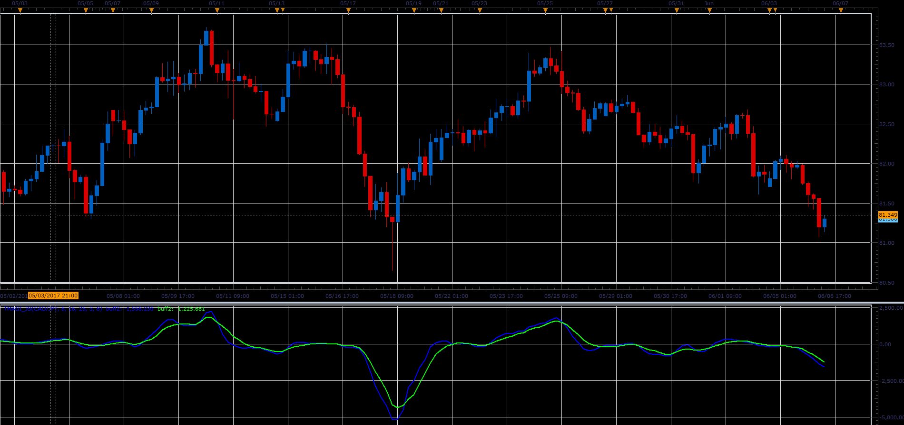

# TMAGi indicator

> Source: https://fxcodebase.com/code/viewtopic.php?f=48&t=64860  
> Forum: 48 · Topic 64860 · 1 post(s)

---

## TMAGi indicator

**Alexander.Gettinger** · Wed Jun 28, 2017 12:21 pm

TMAGi is an oscillator based on 3 Moving Averages.

TMAGi formula is:
Buff[i]=Abs(MVA_Slow-MVA_Middle)+Abs(MVA_Slow-MVA_Fast)+Abs(MVA_Fast-MVA_Middle);
TMAGi1[i]=MVA(Buff) for last SlowingSMA periods before i
TMAGi2[i]=LWMA(Buff) for SlowingLWMA periods before i.

 

Download:

 [TMAGi_JS.jsl](files/113252/TMAGi_JS.jsl)
