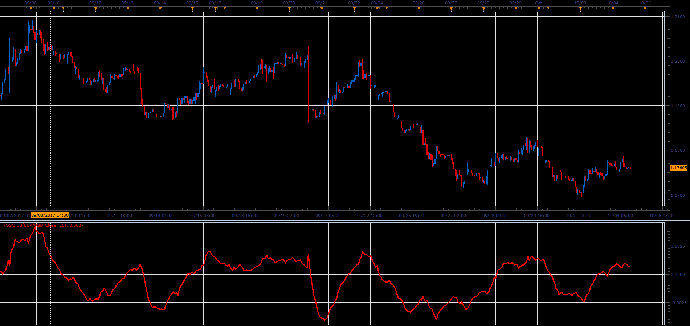

# TOSC oscillator

> Source: https://fxcodebase.com/code/viewtopic.php?f=48&t=65283  
> Forum: 48 · Topic 65283 · 1 post(s)

---

## TOSC oscillator

**Alexander.Gettinger** · Sat Oct 28, 2017 12:44 pm

Formula:
RTL[i] = (1-Alpha)*RTL[i-1]+Alpha*(Price[i]+b0[i]-b0[i-1]),
TOSC[i] = (RTL[i]-EMA(Length, Price)), where
b0[i] = (1-Alpha)*b0[i-1]+Price[i].

 

Download:

 [TOSC_JS.jsl](files/115708/TOSC_JS.jsl)
