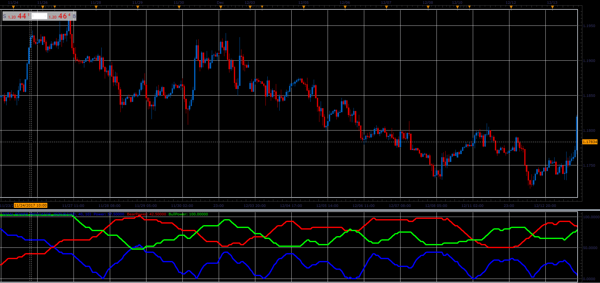

# Total Power Indicator

> Source: https://fxcodebase.com/code/viewtopic.php?f=48&t=65595  
> Forum: 48 · Topic 65595 · 1 post(s)

---

## Total Power Indicator

**Alexander.Gettinger** · Sat Jan 06, 2018 6:26 pm

Total Power Indicator or Improving Elder Ray Indicator

Power = Abs (BearCount - BullCount)*100 / Lookback Period;
BearPower = BearCount*100/ Lookback Period;
BullPower = BullCount*100/Lookback Period ;

The components of this indicator we get, if we count the Elder Ray Indicator components Within the Lookback Period.

But only if Elder Ray Bull is greater than 0,
and Elder Ray Bear is less than 0.

 

Download:

 [Total Power Indicator_JS.jsl](files/116874/Total%20Power%20Indicator_JS.jsl)
