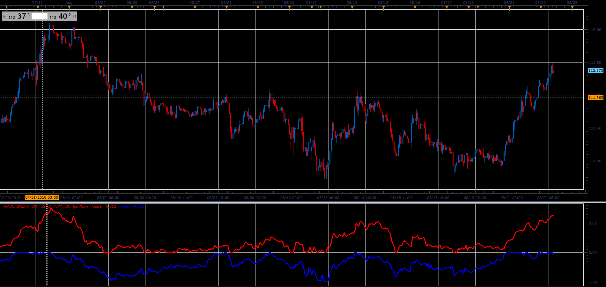

# TradeBreakOut oscillator

> Source: https://fxcodebase.com/code/viewtopic.php?f=48&t=67000  
> Forum: 48 · Topic 67000 · 1 post(s)

---

## TradeBreakOut oscillator

**Alexander.Gettinger** · Sat Nov 24, 2018 5:39 pm

Formulas:
Upper[i] = ((Low[i] or Close[i]) - L)/L,
Lower[i] = ((High[i] or Close[i]) - H)/H, where
H, L - maximum and minimum values of price at range from (i-Period+1) to i.

 

Download:

 [Trade_Break_Out_JS.jsl](files/122329/Trade_Break_Out_JS.jsl)
