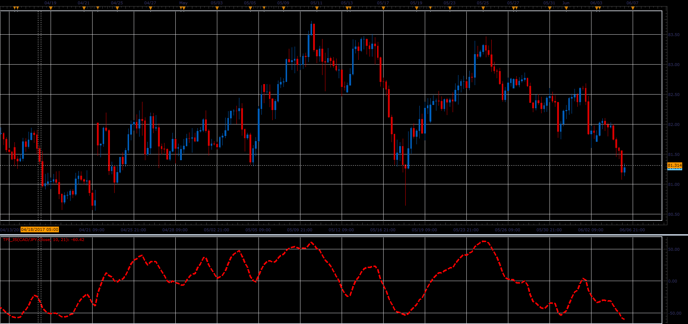

# Trading Channel Index

> Source: https://fxcodebase.com/code/viewtopic.php?f=48&t=64862  
> Forum: 48 · Topic 64862 · 1 post(s)

---

## Trading Channel Index

**Alexander.Gettinger** · Wed Jun 28, 2017 12:24 pm

The Trading Channel Index measures the location of average daily price relative to a smoothed average of average daily price.

 

Download:

 [TPI_JS.jsl](files/113254/TPI_JS.jsl)
