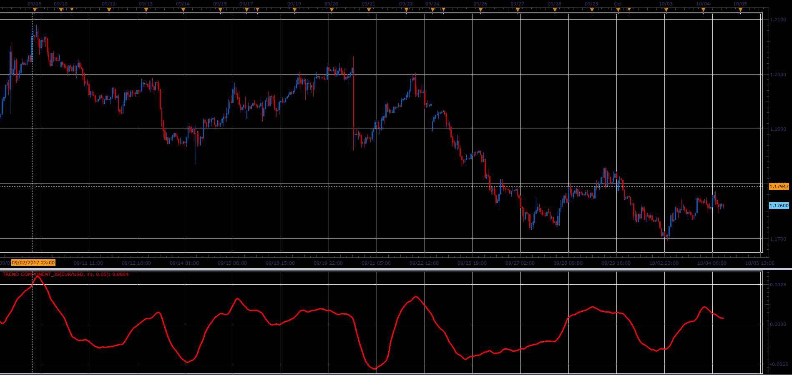

# Trend Component

> Source: https://fxcodebase.com/code/viewtopic.php?f=48&t=65284  
> Forum: 48 · Topic 65284 · 1 post(s)

---

## Trend Component

**Alexander.Gettinger** · Sat Oct 28, 2017 12:46 pm

Description: [https://ctdn.com/algos/indicators/show/29](https://ctdn.com/algos/indicators/show/29)

 

Download:

 [Trend Component_JS.jsl](files/115709/Trend%20Component_JS.jsl)
