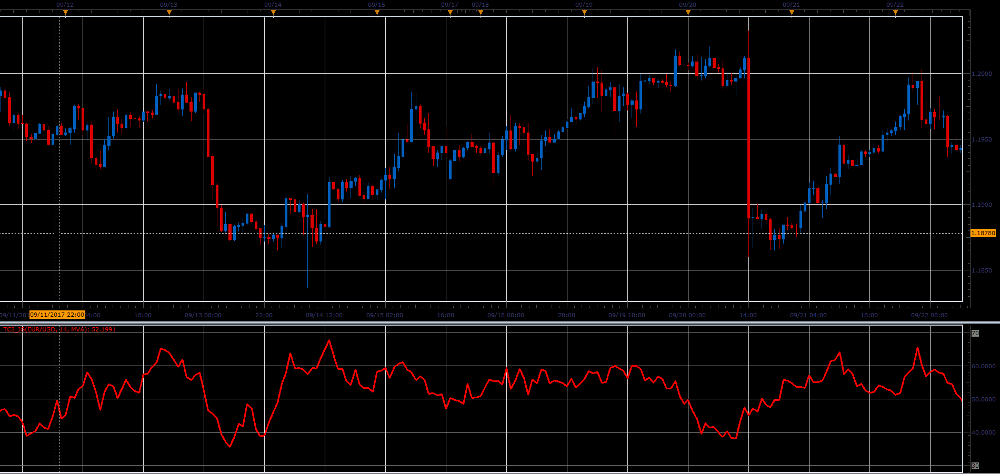

# Trend Confirmation Index

> Source: https://fxcodebase.com/code/viewtopic.php?f=48&t=65277  
> Forum: 48 · Topic 65277 · 1 post(s)

---

## Trend Confirmation Index

**Alexander.Gettinger** · Sat Oct 28, 2017 12:07 pm

As a presumption, the position of the closing price within the candles,
provides information whether the trend is strong or weak, gains or loses power.

TCI will calculate the average of last N position of the closing price within the candles.

Position of Close within the candles are calculated as (C-L) / ((H-L) / 100).

 

Download:

 [TCI_JS.jsl](files/115702/TCI_JS.jsl)
