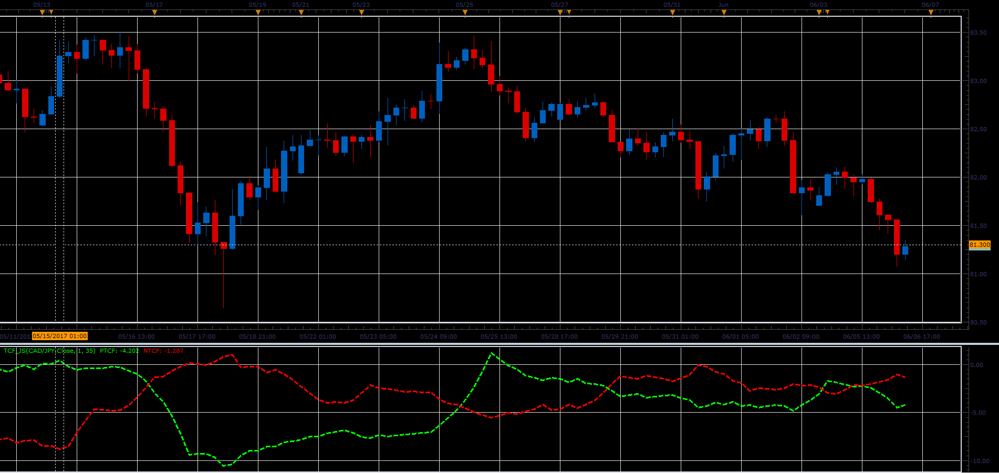

# Trend Continuation Factor

> Source: https://fxcodebase.com/code/viewtopic.php?f=48&t=64857  
> Forum: 48 · Topic 64857 · 1 post(s)

---

## Trend Continuation Factor

**Alexander.Gettinger** · Wed Jun 28, 2017 12:08 pm

The Trend Continuation Factor (TCF) was introduced by M. H. Pee. in the article "Trend Continuation Factor". It was designed to help identify the market trend and direction.

 

Download:

 [TCF_JS.jsl](files/113249/TCF_JS.jsl)
