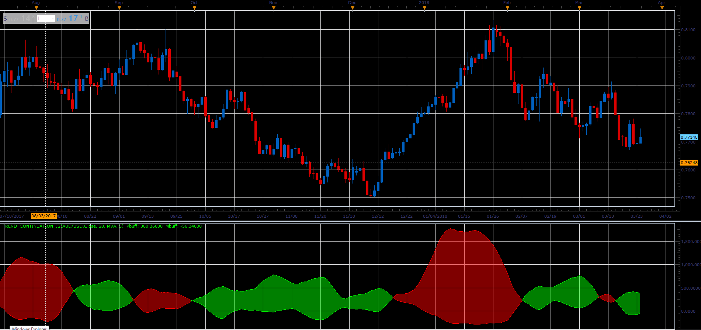

# Trend continuation oscillator

> Source: https://fxcodebase.com/code/viewtopic.php?f=48&t=66084  
> Forum: 48 · Topic 66084 · 1 post(s)

---

## Trend continuation oscillator

**Alexander.Gettinger** · Wed May 02, 2018 2:48 pm

Download:

 [Trend_Continuation_JS.jsl](files/119036/Trend_Continuation_JS.jsl)

For this oscillator must be installed Averages indicator ([viewtopic.php?f=17&t=2430](https://fxcodebase.com/code/viewtopic.php?f=17&t=2430)).
