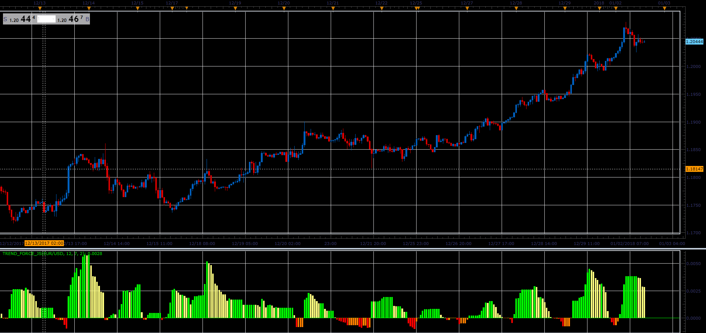

# Trend force oscillator

> Source: https://fxcodebase.com/code/viewtopic.php?f=48&t=65596  
> Forum: 48 · Topic 65596 · 1 post(s)

---

## Trend force oscillator

**Alexander.Gettinger** · Sat Jan 06, 2018 6:27 pm

Formulas:
Trend Force[i] = Up[i]-Dn[i], where
Up[i] = maximum (MaxPrice-ATR_Coeff*ATR) at range from (i-Period+1) to i,
Dn[i] = minimum (MinPrice+ATR_Coeff*ATR) at range from (i-Period+1) to i,
MaxPrice, MinPrice - maximum and minimum prices at range from (i-ATR_Period+1) to i,
ATR - Average True Range with ATR_Period.

 

Download:

 [Trend_Force_JS.jsl](files/116875/Trend_Force_JS.jsl)
