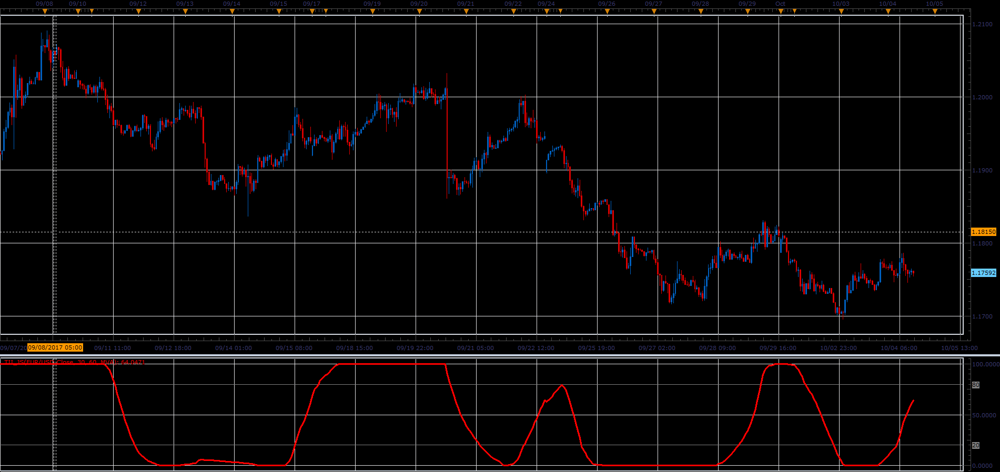

# Trend Intensity Index

> Source: https://fxcodebase.com/code/viewtopic.php?f=48&t=65282  
> Forum: 48 · Topic 65282 · 1 post(s)

---

## Trend Intensity Index

**Alexander.Gettinger** · Sat Oct 28, 2017 12:43 pm

Trend Intensity Index (TII) is based on an article by M. H. Pee that is available in the June 2002 issue of Stocks and Commodities Magazine.

II is used to indicate the strength of the current trend in the market. The stronger the current trend, the more likely the market will continue moving in the current direction.

POS = Close - MA
NEG = MA - Close
TII = 100 * (POS) / (POS +NEG)

 

Download:

 [TII_JS.jsl](files/115707/TII_JS.jsl)
