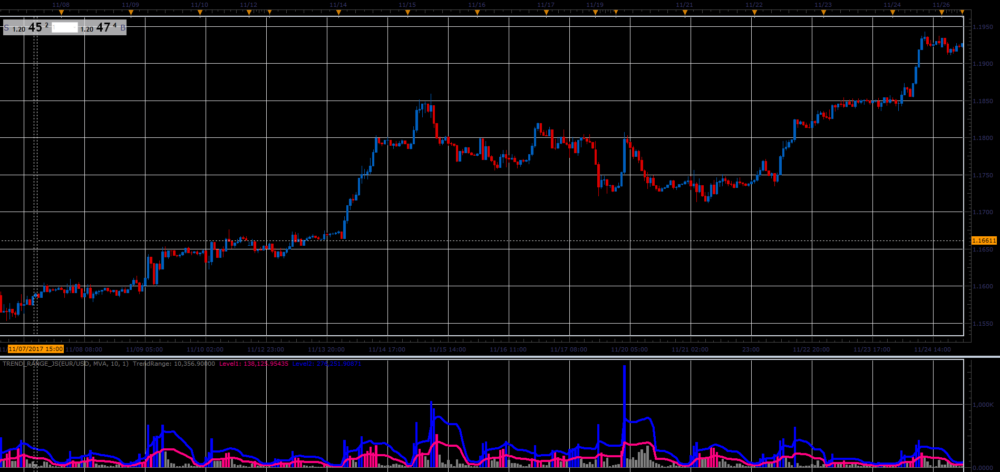

# Trend Range

> Source: https://fxcodebase.com/code/viewtopic.php?f=48&t=65597  
> Forum: 48 · Topic 65597 · 1 post(s)

---

## Trend Range

**Alexander.Gettinger** · Sat Jan 06, 2018 6:29 pm

If Price <Moving Average
and Close is in the upper N, percentage of candle.

If Price> Moving Average
and Close is in the lower N, percentage of candle.

 

Download:

 [Trend_Range_JS.jsl](files/116876/Trend_Range_JS.jsl)
