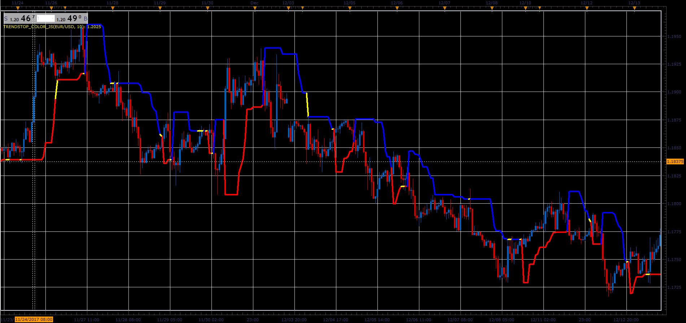

# Trend Stop indicator

> Source: https://fxcodebase.com/code/viewtopic.php?f=48&t=65599  
> Forum: 48 · Topic 65599 · 1 post(s)

---

## Trend Stop indicator

**Alexander.Gettinger** · Sat Jan 06, 2018 6:31 pm

This indicator was created as a byproduct of more complex project on which I work.
Trailing Stop is the High / Low value of the last N periods.
Supports the choice of crossover algorithm.
Close or High / Low.
Have exceptionally good results during strong trends periods, as seen from the attached.

 

Download:

 [TrendStop_Color_JS.jsl](files/116878/TrendStop_Color_JS.jsl)
