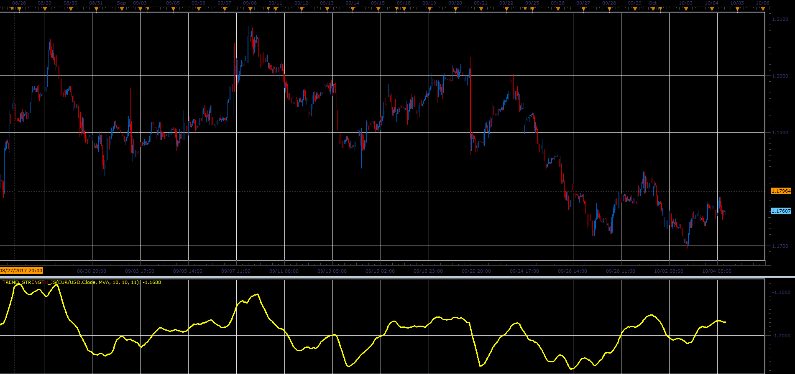

# Trend Strength oscillator

> Source: https://fxcodebase.com/code/viewtopic.php?f=48&t=65286  
> Forum: 48 · Topic 65286 · 1 post(s)

---

## Trend Strength oscillator

**Alexander.Gettinger** · Sat Oct 28, 2017 12:49 pm

Formula:
TrendStrength = MaxSteps*MA0 - res, where
MA0 - moving average with Period,
res = sum of MA(Period), MA(Period+Step), MA(Period+2*Step), ..., MA(Period+MaxSteps*Step).

 

Download:

 [Trend_Strength_JS.jsl](files/115711/Trend_Strength_JS.jsl)

For this indicator must be installed Averages indicator ([viewtopic.php?f=17&t=2430](https://fxcodebase.com/code/viewtopic.php?f=17&t=2430)).
