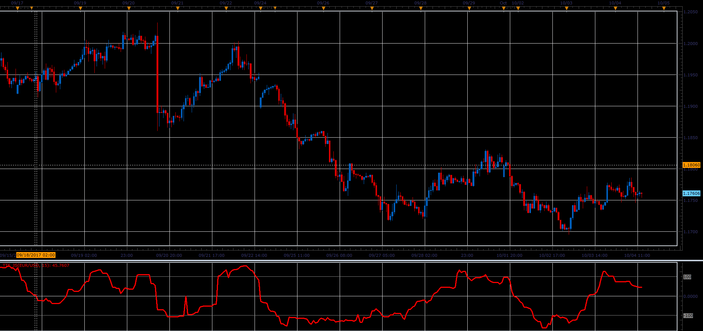

# Trend Trigger Factor

> Source: https://fxcodebase.com/code/viewtopic.php?f=48&t=65288  
> Forum: 48 · Topic 65288 · 1 post(s)

---

## Trend Trigger Factor

**Alexander.Gettinger** · Sat Oct 28, 2017 1:13 pm

M. H. Pee introduces this indicator in his article "Trend Trigger Factor" in the December 2004 issue of Technical Analysis of Stocks and Commodities magazine. The TTF is a method of detecting trends using buy/sell power.

 

Download:

 [TTF_JS.jsl](files/115713/TTF_JS.jsl)
