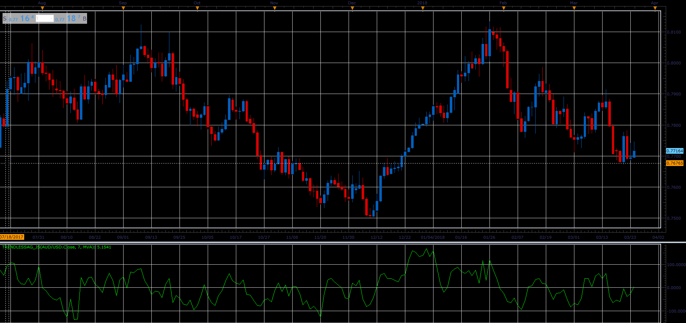

# TrendlessAG oscillator

> Source: https://fxcodebase.com/code/viewtopic.php?f=48&t=66086  
> Forum: 48 · Topic 66086 · 1 post(s)

---

## TrendlessAG oscillator

**Alexander.Gettinger** · Wed May 02, 2018 2:51 pm

Download:

 [TrendlessAG_JS.jsl](files/119038/TrendlessAG_JS.jsl)

For this oscillator must be installed Averages indicator ([viewtopic.php?f=17&t=2430](https://fxcodebase.com/code/viewtopic.php?f=17&t=2430)).
