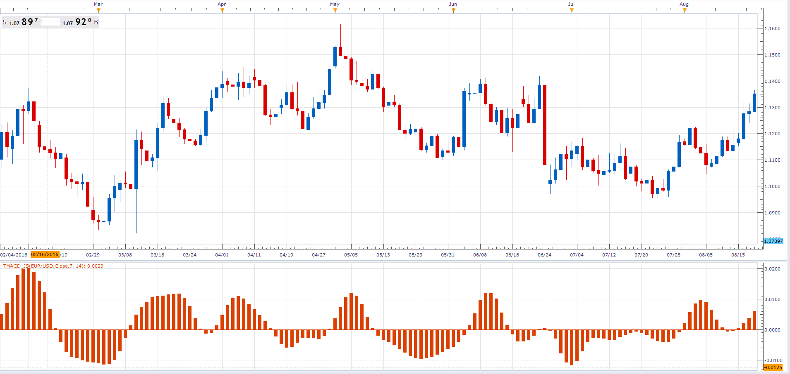

# Triangular Moving Average Convergence/Divergence

> Source: https://fxcodebase.com/code/viewtopic.php?f=48&t=64411  
> Forum: 48 · Topic 64411 · 1 post(s)

---

## Triangular Moving Average Convergence/Divergence

**Alexander.Gettinger** · Fri Feb 03, 2017 7:21 pm

Triangular Moving Average Convergence/Divergence (TMACD).

 

Download:

 [TMACD_JS.jsl](files/110915/TMACD_JS.jsl)
