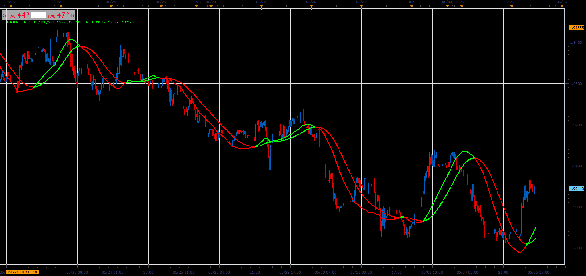

# Trigger lines

> Source: https://fxcodebase.com/code/viewtopic.php?f=48&t=66456  
> Forum: 48 · Topic 66456 · 1 post(s)

---

## Trigger lines

**Alexander.Gettinger** · Tue Aug 07, 2018 11:55 am

The indicator is an implementation of Trigger Lines [https://www.investopedia.com/terms/t/trigger-line.asp](https://www.investopedia.com/terms/t/trigger-line.asp)).

 

Download:

 [Trigger_Lines_JS.jsl](files/120413/Trigger_Lines_JS.jsl)
