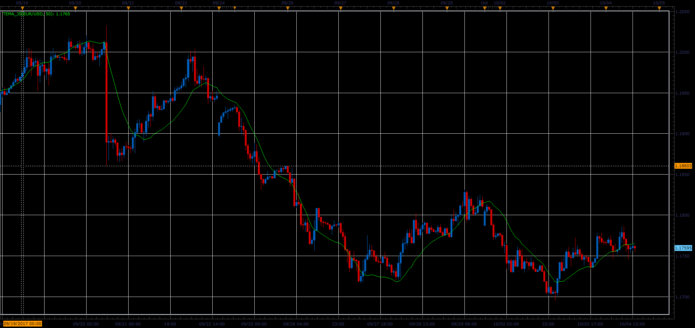

# Triple Exponential Moving Average (TEMA)

> Source: https://fxcodebase.com/code/viewtopic.php?f=48&t=65280  
> Forum: 48 · Topic 65280 · 1 post(s)

---

## Triple Exponential Moving Average (TEMA)

**Alexander.Gettinger** · Sat Oct 28, 2017 12:40 pm

Developed by Patrick Mulloy and introduced in the February 1994 issue of Technical Analysis of Stocks & Commodities magazine, this trend indicator.

As Mr. Mulloy explains in the article:
"Moving averages have a detrimental lag time that increases as the moving average length increases. The solution is a modified version of exponential smoothing with less lag time."

It's possible to use the Triple Exponential Moving Averages in the same way as the Simple Moving Average or Exponential Moving Average.

TEMA = EMA of EMA of EMA of Price

 

Download:

 [TEMA_JS.jsl](files/115705/TEMA_JS.jsl)
