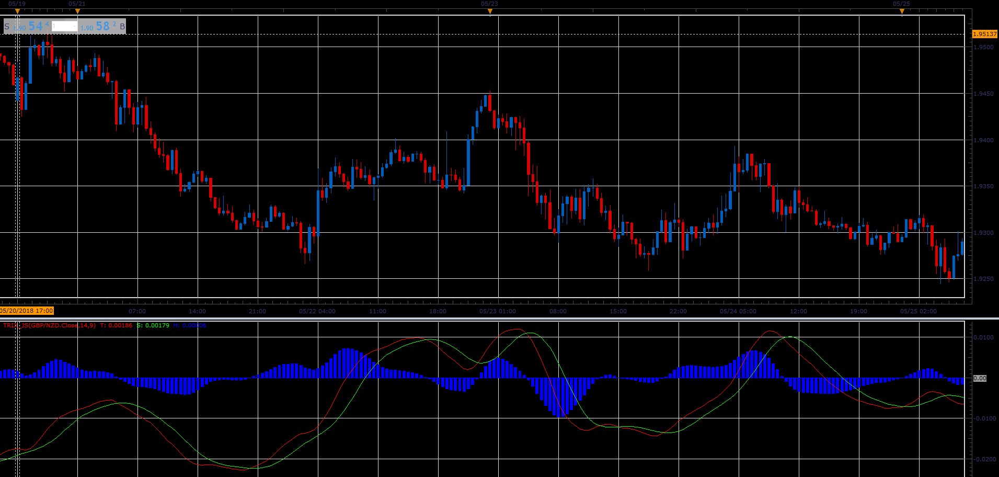

# Trix

> Source: https://fxcodebase.com/code/viewtopic.php?f=48&t=66567  
> Forum: 48 · Topic 66567 · 1 post(s)

---

## Trix

**Alexander.Gettinger** · Sun Aug 19, 2018 2:05 pm

The TRIX Indicator was developed in the early 1980s by Jack Hutson who was an editor for the Technical Analysis of Stocks and Commodities magazine. Its name is comprised of its calculation: Triple Exponential.

The trix indicator is a tripple-smoothed price weighted against the previous tripple-smoothed price:
TrMA = (EMA(EMA(EMA(price, N), N), N)
TRIX(N)i = (TrMAi - TrMAi - 1) / TrMAi - 1).
SIGNAL(N, S) = SMA(TRIX(N), S)

HISTOGRAM = TRIX - SIGNAL

The formula is from Appel, Gerald: Winning Stock Market Systems. Signalert Corp., Great Neck, N.Y. 1974.

The implementation lets you choose methods individually for each moving average. Please note that the methods marked using (*) requires the corresponding indicators to be downloaded and installed.

The common trading rule is:
Buy when TRIX is below zero and crosses its Signal Line from below.
Sell when TRIX is above zero and crosses its Signal Line from above.

 

Download:

 [trix_JS.jsl](files/120674/trix_JS.jsl)
