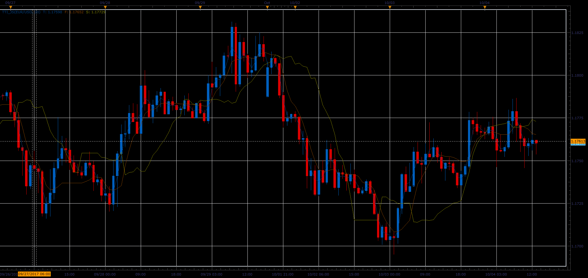

# TTI indicator

> Source: https://fxcodebase.com/code/viewtopic.php?f=48&t=65289  
> Forum: 48 · Topic 65289 · 1 post(s)

---

## TTI indicator

**Alexander.Gettinger** · Sat Oct 28, 2017 1:15 pm

The indicator is nominated as Richard Tao Trailing Signal indicator.
This indicator is the fast predictor. It represents the leading signal of trend.
The TTI is one of the most useful predictors developed by Richard Tao.

The first parameter is "N: Number of periods " which defines price periods.
The second parameter is "M: Periods for Smooth" which defines ma periods.
The third parameter is "D: Distance deviation percentage " which defines gauging level in percentage of one deviation.
The fourth parameter is "C: Coefficient percentage " which defines the multiplier of change coefficient in percentage.
Personal advice is that N better not too small and the applying timeframe D1 may use:20,2,100,100; H4:30,2,100,100; H1:30,1,100,100.

The TTI applying rules:
When T crosses up S, signal to buy. S is regarding as supporting on bottom.
When T crosses down S, signal to sell. S is regarding as resistance on top.

 

Download:

 [TTI_JS.jsl](files/115714/TTI_JS.jsl)
