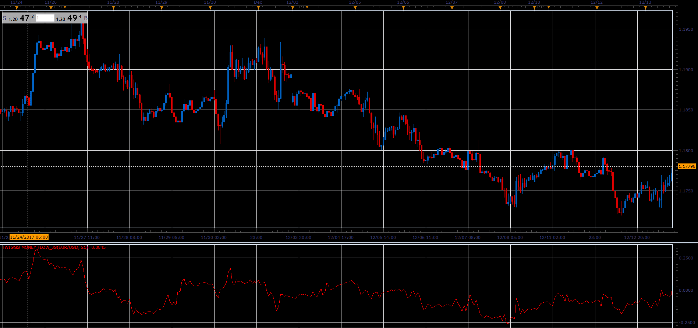

# Twiggs Money Flow

> Source: https://fxcodebase.com/code/viewtopic.php?f=48&t=65601  
> Forum: 48 · Topic 65601 · 1 post(s)

---

## Twiggs Money Flow

**Alexander.Gettinger** · Sat Jan 06, 2018 6:36 pm

Twiggs Money Flow signals accumulation if above zero, while negative values signal distribution. The higher the reading (above or below zero), the stronger the signal.

 

Download:

 [Twiggs Money Flow_JS.jsl](files/116880/Twiggs%20Money%20Flow_JS.jsl)
