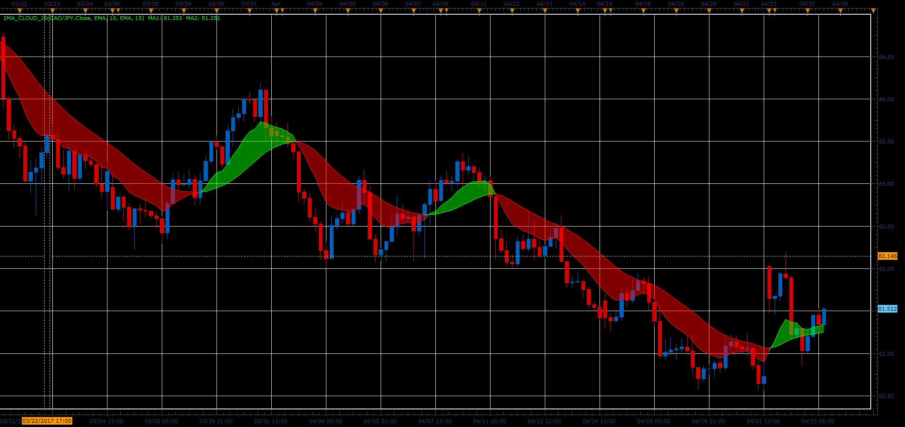

# Two MA cloud indicator

> Source: https://fxcodebase.com/code/viewtopic.php?f=48&t=64752  
> Forum: 48 · Topic 64752 · 1 post(s)

---

## Two MA cloud indicator

**Alexander.Gettinger** · Mon Jun 05, 2017 11:53 am

The indicator draws the strip between the two MA.

Formulas:
MA1 = MA(Price),
MA2 = MA(MA1).

 

Download:

 [2MA_Cloud_JS.jsl](files/112763/2MA_Cloud_JS.jsl)
