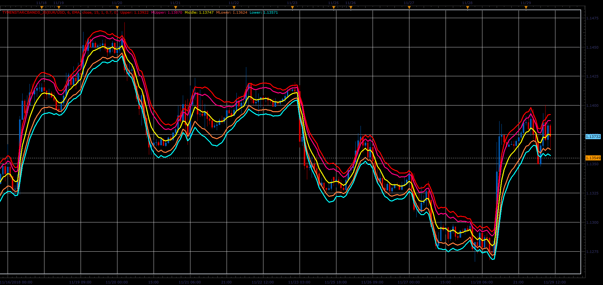

# Tymen STARC Bands

> Source: https://fxcodebase.com/code/viewtopic.php?f=48&t=67117  
> Forum: 48 · Topic 67117 · 1 post(s)

---

## Tymen STARC Bands

**Alexander.Gettinger** · Fri Dec 07, 2018 3:20 pm

Formulas:
Middle=MA,
Upper=MA+KATR*ATR,
Lower=MA-KATR*ATR,
MUpper=MA+MKATR*ATR,
MLower=MA-MKATR*ATR, where
KATR, MKATR is a indicator parameters.

 

Download:

 [TymenSTARCBands_JS.jsl](files/122628/TymenSTARCBands_JS.jsl)

Indicator Averages ([viewtopic.php?f=17&t=2430](https://fxcodebase.com/code/viewtopic.php?f=17&t=2430)) must be installed.
