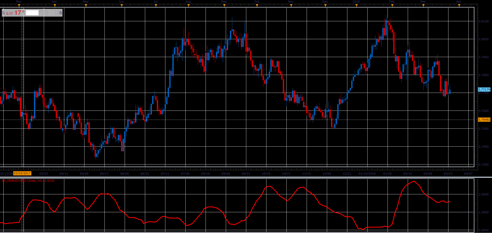

# Ulcer Index

> Source: https://fxcodebase.com/code/viewtopic.php?f=48&t=66088  
> Forum: 48 · Topic 66088 · 1 post(s)

---

## Ulcer Index

**Alexander.Gettinger** · Wed May 02, 2018 2:54 pm

Developed by Peter Martin and Byron McCann in 1987, the Ulcer Index is a volatility indicator that measures downside risk.
It's designed as a measure of volatility, but only volatility in the downward direction, i.e. the amount of drawdown or retracement occurring over a period.
Many consider the Ulcer Index superior to the standard deviation and other measures of risk.

 

Download:

 [UI_JS.jsl](files/119040/UI_JS.jsl)
