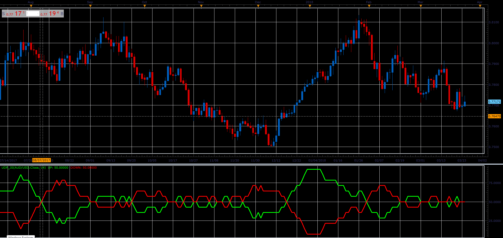

# Up/Down Percentage

> Source: https://fxcodebase.com/code/viewtopic.php?f=48&t=66087  
> Forum: 48 · Topic 66087 · 1 post(s)

---

## Up/Down Percentage

**Alexander.Gettinger** · Wed May 02, 2018 2:52 pm

Formulas:
UP = MVA(UpF) with [Length] number of periods,
DN = MVA(DnF) with [Length] number of periods, where
UpF = 1, if Price[i]>Price[i-1], else UpF[i] = 0,
DnF = 1, if Price[i]<Price[i-1], else DnF[i] = 0.

 

Download:

 [UDP_JS.jsl](files/119039/UDP_JS.jsl)
