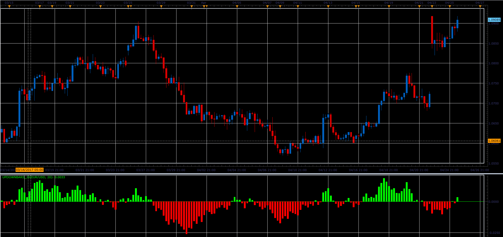

# UpDownBars indicator

> Source: https://fxcodebase.com/code/viewtopic.php?f=48&t=64747  
> Forum: 48 · Topic 64747 · 1 post(s)

---

## UpDownBars indicator

**Alexander.Gettinger** · Mon Jun 05, 2017 11:32 am

Formula:
UpDownBars=lwma(up)-lwma(down), where
lwma - linear weighted moving average,
up, down are a sum of square roots from positive and negative values (Close-Open).

 

Download:

 [UpDownBars_JS.jsl](files/112758/UpDownBars_JS.jsl)
