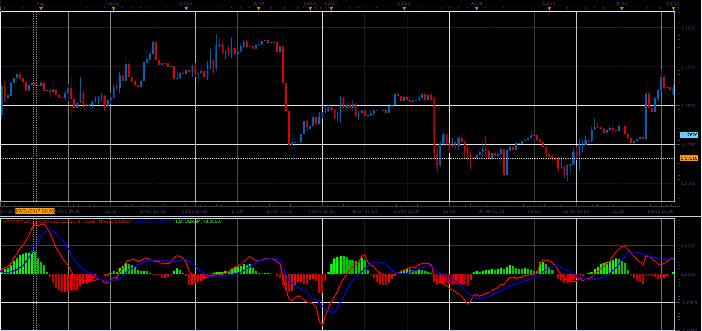

# VAMA MACD

> Source: https://fxcodebase.com/code/viewtopic.php?f=48&t=65298  
> Forum: 48 · Topic 65298 · 1 post(s)

---

## VAMA MACD

**Alexander.Gettinger** · Sat Oct 28, 2017 2:25 pm

This version of MACD uses Volume Adjusted Moving Average (VAMA) for smoothing.

 

Download:

 [VAMA MACD_JS.jsl](files/115723/VAMA%20MACD_JS.jsl)
