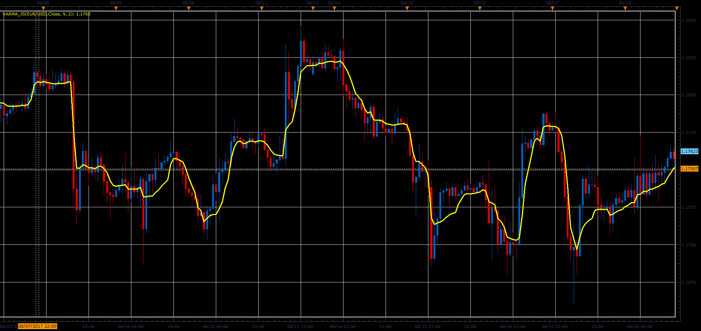

# Variable Moving Average(VARMA)

> Source: https://fxcodebase.com/code/viewtopic.php?f=48&t=65300  
> Forum: 48 · Topic 65300 · 1 post(s)

---

## Variable Moving Average(VARMA)

**Alexander.Gettinger** · Sat Oct 28, 2017 2:30 pm

Variable moving average is an exponential moving average that automatically adjusts the smoothing constant based on the volatility of the data series. The more volatile the data, the larger the smoothing constant used in the moving average calculation. The larger the smoothing constant, the more weight given to the current data. The opposite is true for less volatile data.

Typical moving averages suffer from the inability to compensate for changes in volatility. During volatile markets, you want a moving average to increase its sensitivity, so that you will quickly be on the correct side of any wild gyrations. By automatically adjusting the smoothing constant, a variable moving average is able to adjust its sensitivity, allowing it to perform better in both high and low volatility markets.

AbsCMO:=(Abs(CMO(Close,CMOPeriod)))/100;
SC:=2/(SmoothPeriod+1);
if period > CMOPeriod + SmoothPeriod+ 2 then
VARMA=(SC*AbsCMO*C)+(1-(SC*AbsCMO))*VARMA[PREV]);
else
VARMA = Close
end

The absolute value of a 9-period Chande Momentum Oscillator is used for the volatility index. The higher this index the more volatile the market, thereby increasing the sensitivity of the moving average.

This method of calculating a variable moving average was presented by Tushar Chande in the March 1992 issue of Technical Analysis of Stocks & Commodities magazine.

 

Download:

 [VARMA_JS.jsl](files/115725/VARMA_JS.jsl)
