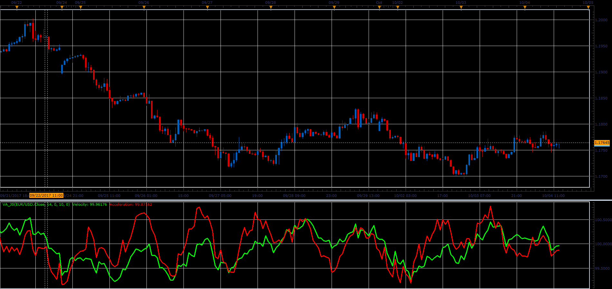

# Velocity/Acceleration oscillator

> Source: https://fxcodebase.com/code/viewtopic.php?f=48&t=65294  
> Forum: 48 · Topic 65294 · 1 post(s)

---

## Velocity/Acceleration oscillator

**Alexander.Gettinger** · Sat Oct 28, 2017 1:23 pm

Velocity=source[period]*100/source[period-Velocity];
Velocity = Momentum of Price;
Acceleration
Acceleration = Velocity[period]*100/Velocity[period-AccelerationPeriod];
Acceleration = Momentum of Velocity;

 

Download:

 [VA_JS.jsl](files/115719/VA_JS.jsl)
