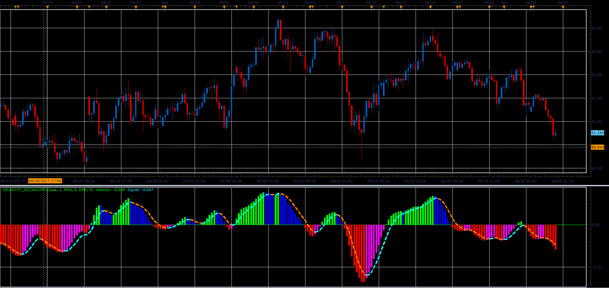

# Velocity oscillator

> Source: https://fxcodebase.com/code/viewtopic.php?f=48&t=64875  
> Forum: 48 · Topic 64875 · 1 post(s)

---

## Velocity oscillator

**Alexander.Gettinger** · Mon Jul 03, 2017 12:16 pm

Formulas:
Velocity = MA3-100,
Signal = MA4-100, where
MA4 = Moving average(MA3) with Signal_Method as Method and Signal_Period as Period,
MA3 = Moving average(MA2) with Velocity_Method as Method and Velocity_Period as Period,
MA2 = Moving average(MA1) with Velocity_Method as Method and Velocity_Period as Period,
MA1 = Moving average(Momentum) with Velocity_Method as Method and Velocity_Period as Period.

 

Download:

 [Velocity_JS.jsl](files/113368/Velocity_JS.jsl)
