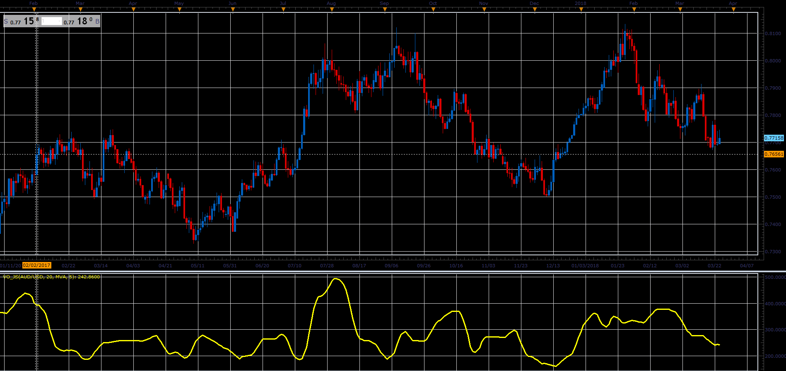

# Vo oscillator

> Source: https://fxcodebase.com/code/viewtopic.php?f=48&t=66091  
> Forum: 48 · Topic 66091 · 1 post(s)

---

## Vo oscillator

**Alexander.Gettinger** · Wed May 02, 2018 2:58 pm

Formulas:
Vo[i] = MA(Range), where
Range = Max-Min,
Max, Min - maximum and minimum prices at range from (i-Period+1) to i.

 

Download:

 [Vo_JS.jsl](files/119043/Vo_JS.jsl)

For this oscillator must be installed Averages indicator ([viewtopic.php?f=17&t=2430](https://fxcodebase.com/code/viewtopic.php?f=17&t=2430)).
