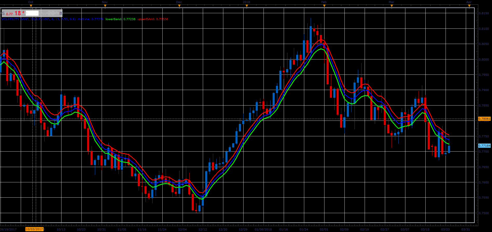

# Volatility band

> Source: https://fxcodebase.com/code/viewtopic.php?f=48&t=66092  
> Forum: 48 · Topic 66092 · 1 post(s)

---

## Volatility band

**Alexander.Gettinger** · Wed May 02, 2018 2:59 pm

As described by Sylvain Vervoort's article "Within The Volatility Band."

Formulas:
Middle = EMA(Length_Vol_Band, Typical price),
Lower = Middle-devLow,
Upper = Middle+devHigh, where
devLow = devHigh*Low_Band_Adjust,
devHigh = EMA(Length_Vol_Band, V_Value),
V_Value = MVA(tpSeries, Length_Vol)/Dev_Factor,
tpSeries[i] = Typical price[i] - Low price[i-1] if Typical price[i]>=Typical price[i-1],
tpSeries[i] = Typical price[i+1] - Low price[i] if Typical price[i]<Typical price[i-1].

 

Download:

 [Volatility Band_JS.jsl](files/119044/Volatility%20Band_JS.jsl)
