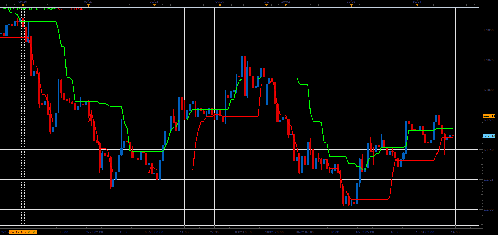

# Volatility Channel

> Source: https://fxcodebase.com/code/viewtopic.php?f=48&t=65302  
> Forum: 48 · Topic 65302 · 1 post(s)

---

## Volatility Channel

**Alexander.Gettinger** · Sat Oct 28, 2017 2:32 pm

Formulas:
Top = max( ( ( ( (H+L+C) / 3 ) * 2 ) - H) , Top),
Bottom = min( ( ( ( (H+L+C) / 3 ) * 2 ) - L) , Bottom).

 

Download:

 [VC_JS.jsl](files/115727/VC_JS.jsl)
