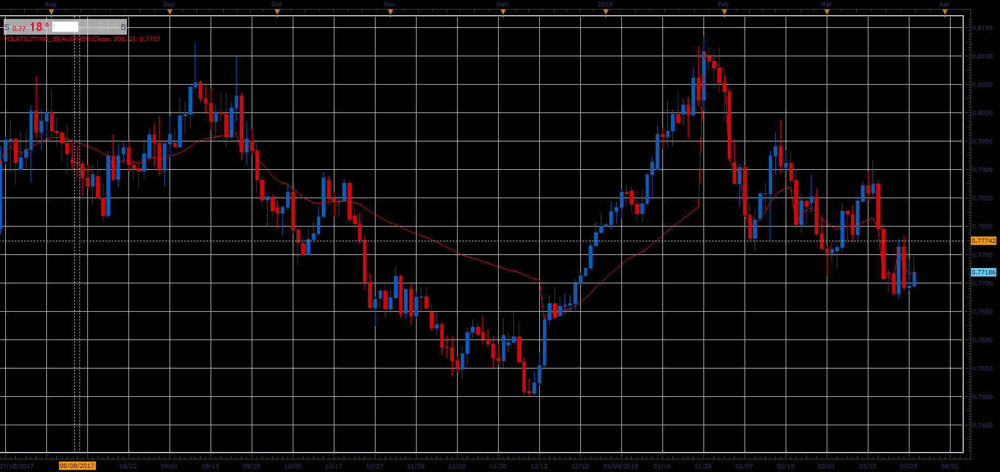

# Volatility Moving Average

> Source: https://fxcodebase.com/code/viewtopic.php?f=48&t=66095  
> Forum: 48 · Topic 66095 · 1 post(s)

---

## Volatility Moving Average

**Alexander.Gettinger** · Wed May 02, 2018 3:03 pm

Benoit Mandelbrot, in his book, The Misbehavior of Markets, discusses important consequences on the fractal nature of markets. All charts, whether you view the fifteen minute or the daily, resemble each other.
Volatility Moving Average a.k.a. Resetting Moving Average Indicator
attempts to eliminate this by resetting average period Whenever a candle closes more than 2 standard deviations beyond the previous close.

 

Download:

 [VolatilityMA_JS.jsl](files/119047/VolatilityMA_JS.jsl)
