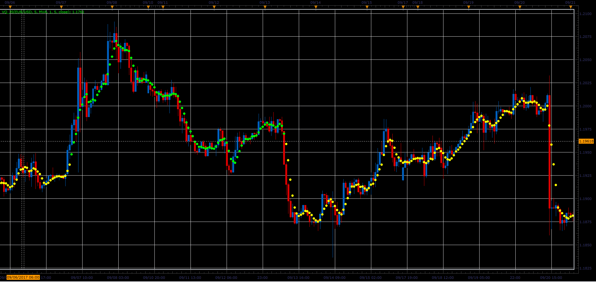
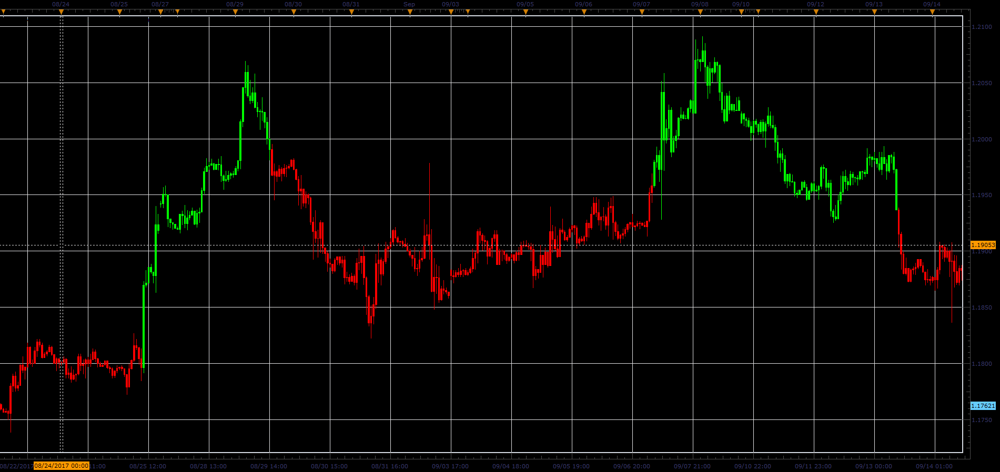
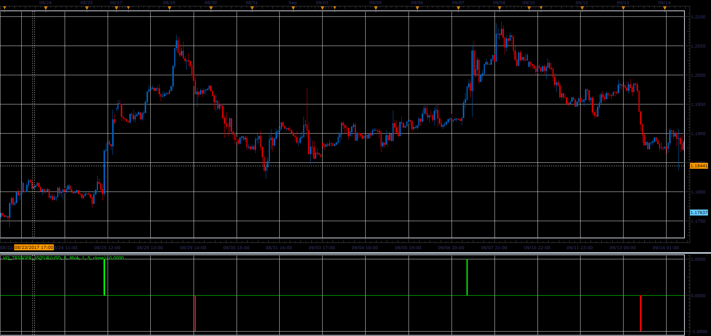
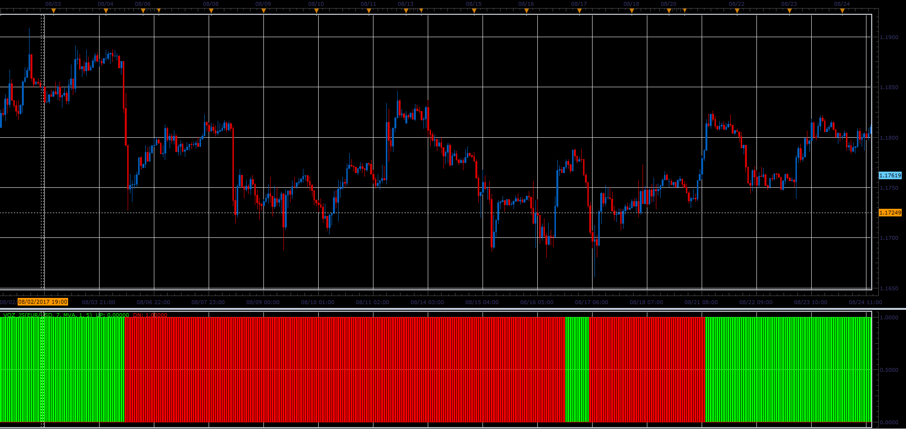
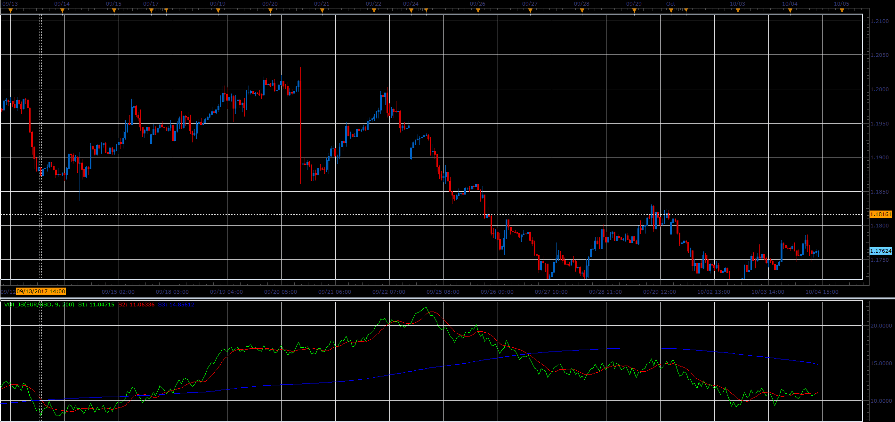

# Volatility Quality indicator

> Source: https://fxcodebase.com/code/viewtopic.php?f=48&t=65308  
> Forum: 48 · Topic 65308 · 1 post(s)

---

## Volatility Quality indicator

**Alexander.Gettinger** · Sat Oct 28, 2017 2:42 pm

Formulas:
VQ[i]=MA_C[i] and UP color if Dir[i]>0 or DN color if Dir[i]<0, where
Dir[i]>0 if Var>0 and Dir[i]<0 if Var<0,
if abs(Var)<Filter(in pips) Dir[i]=Dir[i-1],
Var=0.25*abs((MA_C[i]-MA_C[i-Smoothing])/Max+(MA_C[i]-MA_O[i])/(MA_H[i]-MA_L[i]))*(2*MA_C[i]-MA_C[i-Smoothing]-MA_O[i]),
Max[i]=Max(MA_H[i]-MA_L[i],MA_H[i]-MA_C[i-Smoothing],MA_C[i-Smoothing]-MA_L[i]),
MA_H - moving average for High,
MA_L - moving average for Low,
MA_O - moving average for Open,
MA_C - moving average for [MainPrice].

 

Download:

 [VQ_JS.jsl](files/115733/VQ_JS.jsl)

**VQ candles:**

Indicator paints the bars, in accordance with VQ.

 

Download:

 [VQ_Candles_JS.jsl](files/115733/VQ_Candles_JS.jsl)

**VQ trigger:**

 

Download:

 [VQ_Trigger_JS.jsl](files/115733/VQ_Trigger_JS.jsl)

**VQz indicator:**

 

Download:

 [VQz_JS.jsl](files/115733/VQz_JS.jsl)

**Volatility quality index:**

 

Download:

 [VQI_JS.jsl](files/115733/VQI_JS.jsl)
