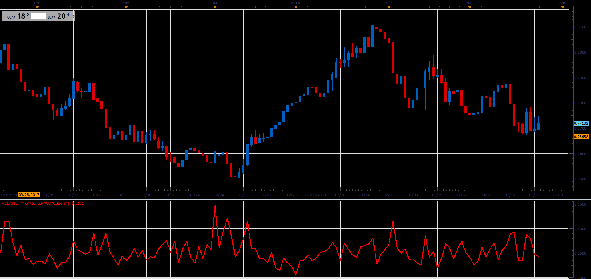

# Volatility Ratio

> Source: https://fxcodebase.com/code/viewtopic.php?f=48&t=66093  
> Forum: 48 · Topic 66093 · 1 post(s)

---

## Volatility Ratio

**Alexander.Gettinger** · Wed May 02, 2018 3:01 pm

Formulas:
VR[i] = tr[i]/pr[i], where
tr[i] = Max(hl[i], hc[i], lc[i]),
hl[i] = High[i]-Low[i],
hc[i] = Abs(High[i]-Close[i-1]),
lc[i] = Abs(Low[i]-Close[i-1]),
pr[i] = Max(MH, Open[i-Length+1])-Min(ML, Open[i-Length+1]),
MH, ML - maximum and minimum prices at range from (i-Length+1) to (i).

 

Download:

 [Volatility Ratio_JS.jsl](files/119045/Volatility%20Ratio_JS.jsl)
