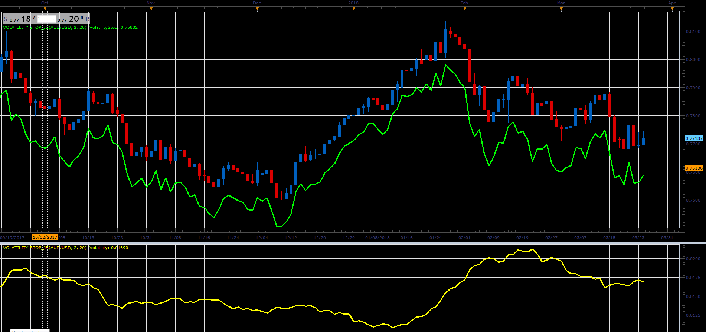

# Volatility Stop

> Source: https://fxcodebase.com/code/viewtopic.php?f=48&t=66094  
> Forum: 48 · Topic 66094 · 1 post(s)

---

## Volatility Stop

**Alexander.Gettinger** · Wed May 02, 2018 3:02 pm

Inspired by the article "10 Selling Tips" by Thomas Bulkowski

Formula:
VS[i] = Multiplier*HiLoAvg/Close[i], where
HiLoAvg = MA_H-MA_L,
MA_H - MVA(High) with [Length] number of periods,
MA_L - MVA(Low) with [Length] number of periods.

 

Download:

 [Volatility Stop_JS.jsl](files/119046/Volatility%20Stop_JS.jsl)
