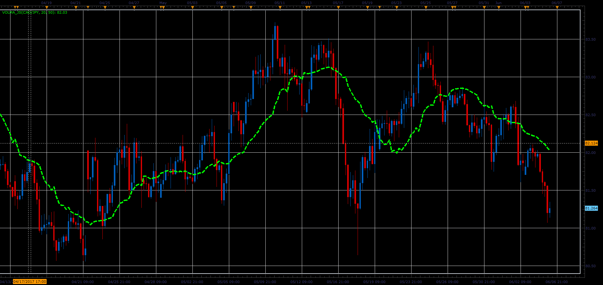

# VolMA indicator

> Source: https://fxcodebase.com/code/viewtopic.php?f=48&t=64876  
> Forum: 48 · Topic 64876 · 1 post(s)

---

## VolMA indicator

**Alexander.Gettinger** · Mon Jul 03, 2017 12:17 pm

Formula:
VolMA=MVA(Price), where
Period of MVA=RSI(Volume)*[Period]/100.

 

Download:

 [VolMA_JS.jsl](files/113369/VolMA_JS.jsl)
