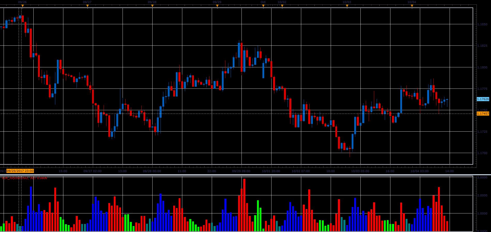

# Voltest (VLM)

> Source: https://fxcodebase.com/code/viewtopic.php?f=48&t=65305  
> Forum: 48 · Topic 65305 · 1 post(s)

---

## Voltest (VLM)

**Alexander.Gettinger** · Sat Oct 28, 2017 2:36 pm

VLM[period] = Volume[period] / Avg ( Volume, MA_Period);
Ma_Period vary depending on the Time Frame you are using.

 

Download:

 [VLM_JS.jsl](files/115730/VLM_JS.jsl)
