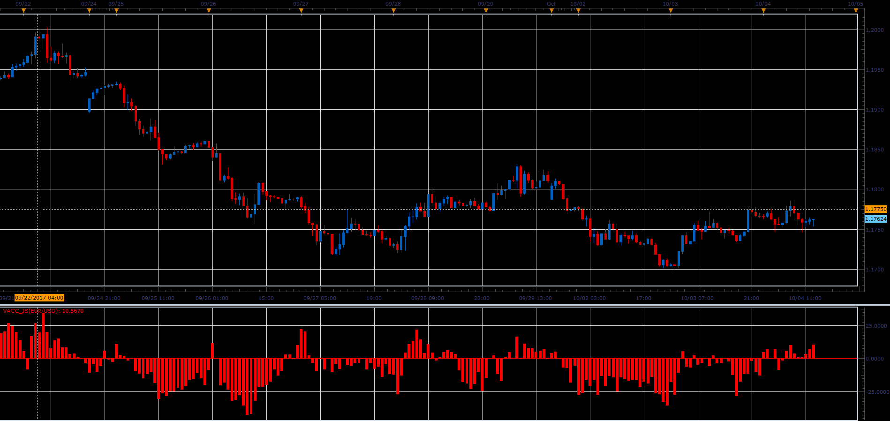

# Volume Accumulation Percentage Indicator

> Source: https://fxcodebase.com/code/viewtopic.php?f=48&t=65297  
> Forum: 48 · Topic 65297 · 1 post(s)

---

## Volume Accumulation Percentage Indicator

**Alexander.Gettinger** · Sat Oct 28, 2017 2:23 pm

Formula:
VA = Volume * ((Close-Low)-(High-Close))/(High-Low).
TVA= N period Sum of VA
TV = N period Sum of Volume
VACC[period] = (TVA / TV) * 100

 

Download:

 [VACC_JS.jsl](files/115722/VACC_JS.jsl)
