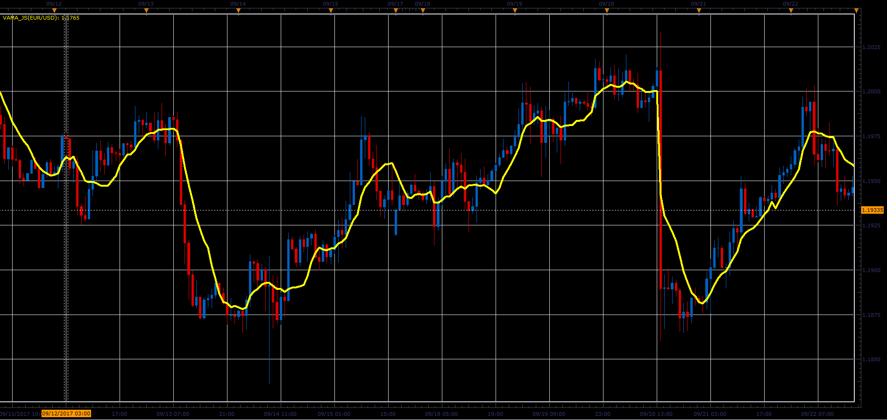

# Volume Adjusted Moving Average (VAMA)

> Source: https://fxcodebase.com/code/viewtopic.php?f=48&t=65299  
> Forum: 48 · Topic 65299 · 1 post(s)

---

## Volume Adjusted Moving Average (VAMA)

**Alexander.Gettinger** · Sat Oct 28, 2017 2:27 pm

Volume Adjusted Moving Average ( VAMA)
It is calculated by dividing the value of transactions, by the total volume for the period of interest.

 

Download:

 [VAMA_JS.jsl](files/115724/VAMA_JS.jsl)
