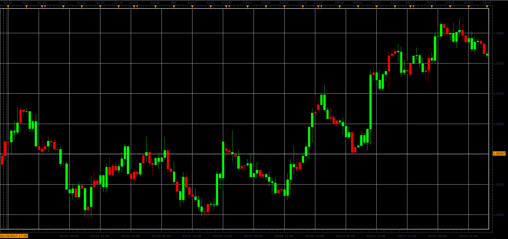

# Volume candles indicator

> Source: https://fxcodebase.com/code/viewtopic.php?f=48&t=64748  
> Forum: 48 · Topic 64748 · 1 post(s)

---

## Volume candles indicator

**Alexander.Gettinger** · Mon Jun 05, 2017 11:35 am

The bar has a UP color if the volume on it more than volume of previous bar.
The bar has a DN color if the volume on it less than volume of previous bar.

 

Download:

 [Volume_Candles_JS.jsl](files/112759/Volume_Candles_JS.jsl)
