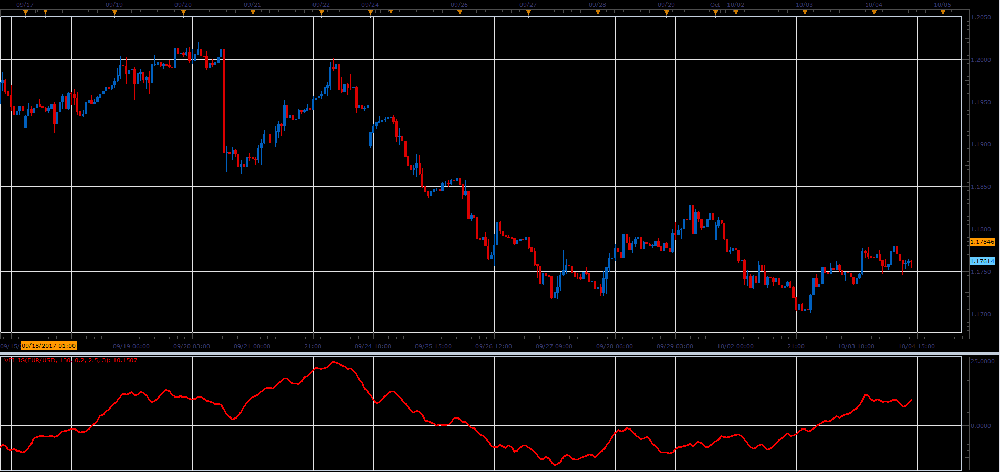

# Volume Flow oscillator

> Source: https://fxcodebase.com/code/viewtopic.php?f=48&t=65303  
> Forum: 48 · Topic 65303 · 1 post(s)

---

## Volume Flow oscillator

**Alexander.Gettinger** · Sat Oct 28, 2017 2:34 pm

This indicator was first introduced in my June 2004 article in Technical Analysis of STOCKS & COMMODITIES.
A level above zero is considered bullish and indicates accumulation.
Values below zero indicate distribution.
A divergence in volume can be evidence of a reversal.
The VFI is based on Balance Volume (OBV).

 

Download:

 [VFI_JS.jsl](files/115728/VFI_JS.jsl)
