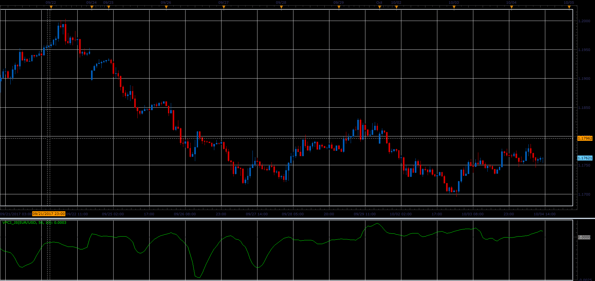

# Volume price confirmation indicator (VPCI)

> Source: https://fxcodebase.com/code/viewtopic.php?f=48&t=65307  
> Forum: 48 · Topic 65307 · 4 post(s)

---

## Volume price confirmation indicator (VPCI)

**Alexander.Gettinger** · Sat Oct 28, 2017 2:39 pm

VPCI finds the relation between price and volume.

Formulas:
VPCI=VPC*VPR*VM, where
VPC=VWMA(Slow_period)-SMA(Slow_period),
VWMA=Sum(Price_close*Volume),
SMA=Sum(Price_close),
VPR=VWMA(Fast_period)/SMA(Fast_period),
VM=(Sum(Volume,Fast_period)*Slow_period)/(Sum(Volume,Slow_period)*Fast_period).

 

Download:

 [VPCI_JS.jsl](files/115732/VPCI_JS.jsl)

---

## Re: Volume price confirmation indicator (VPCI)

**logicgate** · Tue Jan 01, 2019 2:52 pm

My friend I am sorry for posting many messages in a row here, you can delete the previous if you want to not clutter the thread.

I digged a little more and found this MT4 version of VPCI, but it is from 2013 so it just needs to be updated to the latest builds of MT4, thanks! (attached the file)

---

## Re: Volume price confirmation indicator (VPCI)

**Apprentice** · Wed Jan 02, 2019 6:12 am

Try this version.
[viewtopic.php?f=38&t=61609](https://fxcodebase.com/code/viewtopic.php?f=38&t=61609)

---

## Re: Volume price confirmation indicator (VPCI)

**logicgate** · Wed Jan 02, 2019 6:34 am

> **Apprentice wrote:**
> Try this version.
> [viewtopic.php?f=38&t=61609](https://fxcodebase.com/code/viewtopic.php?f=38&t=61609)

Thank you!!
