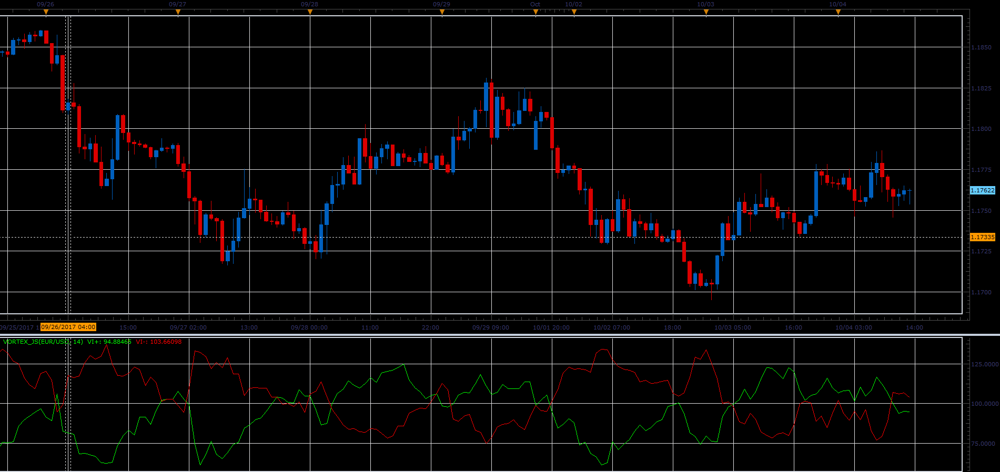

# Vortex Indicator

> Source: https://fxcodebase.com/code/viewtopic.php?f=48&t=65306  
> Forum: 48 · Topic 65306 · 1 post(s)

---

## Vortex Indicator

**Alexander.Gettinger** · Sat Oct 28, 2017 2:38 pm

Vortex, developed by Etienne Botes & Douglas Siepman of [http://www.VortexFund.com](http://www.VortexFund.com), uses the relationship between today's high and yesterday's low for VM+ (similar to DMI+) and today's low and yesterday's high for VM- (similar to DMI-).

 

Download:

 [VORTEX_JS.jsl](files/115731/VORTEX_JS.jsl)
