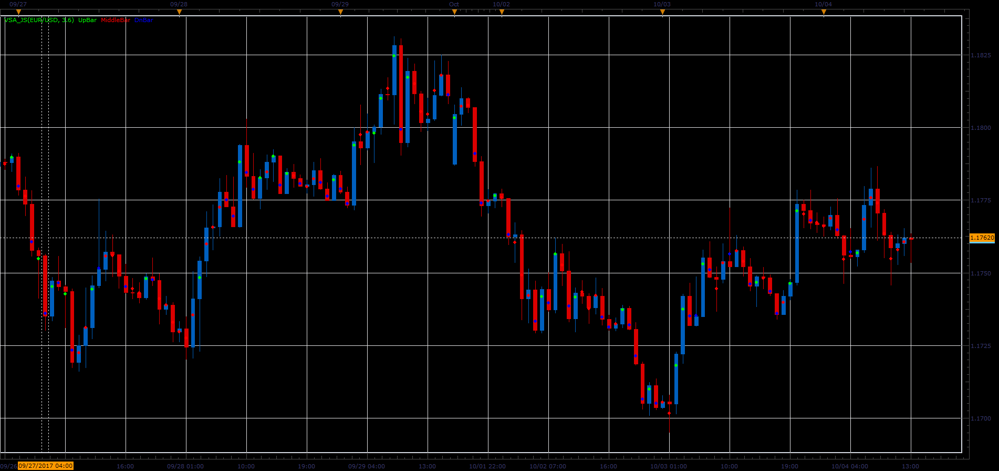

# VSA indicator

> Source: https://fxcodebase.com/code/viewtopic.php?f=48&t=65309  
> Forum: 48 · Topic 65309 · 1 post(s)

---

## VSA indicator

**Alexander.Gettinger** · Sat Oct 28, 2017 2:49 pm

Formulas:
The bar is:
UP, if Close>UpPrice;
DN, if Close<DnPrice;
Middle, if DnPrice<Close<UpPrice.

UpPrice=MiddlePrice+D,
DnPrice=MiddlePrice-D, where
MiddlePrice=(High+Low)/2,
D=(High-Low)/K.

 

Download:

 [VSA_JS.jsl](files/115734/VSA_JS.jsl)
